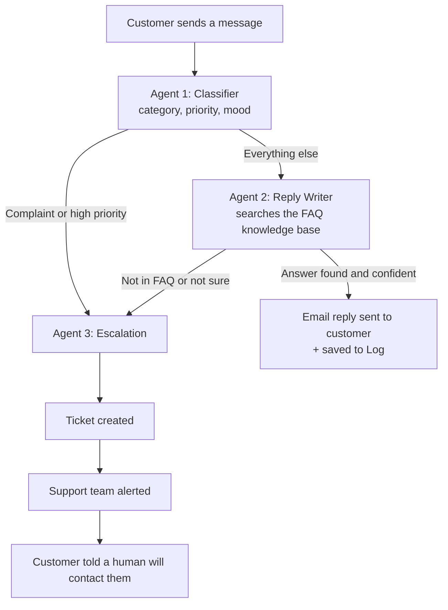

# 🎧 SupportSync AI
### A Multi-Agent AI Customer Support Desk

> **One line:** SupportSync AI reads every customer message, answers the easy ones instantly from the company's own FAQ, and hands the hard or angry ones to a human with a ready-made ticket, so customers get faster help and support teams only work on cases that really need a person.

**Category:** Business Process Automation (Multi-Agent Systems + Agentic AI)
**Built for:** Pak Angels – Generative & Agentic AI, Cohort 11 – 2nd Hackathon
**Live demo:** https://supportsync-ai---multi-agent-support-desk-ohz25y2g7xz9nu9ekhzd.streamlit.app/


---

## Table of contents
1. [The problem (in plain words)](#1-the-problem-in-plain-words)
2. [Our solution](#2-our-solution)
3. [How it works, step by step](#3-how-it-works-step-by-step)
4. [Meet the three agents](#4-meet-the-three-agents)
5. [Real examples from our testing](#5-real-examples-from-our-testing)
6. [Tech stack: what we used and why](#6-tech-stack-what-we-used-and-why)
7. [Architecture](#7-architecture)
8. [Key design decisions (what makes it trustworthy)](#8-key-design-decisions-what-makes-it-trustworthy)
9. [Who benefits and how](#9-who-benefits-and-how)
10. [The app: screen by screen](#10-the-app-screen-by-screen)
11. [Project structure](#11-project-structure)
12. [How to run it](#12-how-to-run-it)
13. [Deploy it online (Streamlit Cloud)](#13-deploy-it-online-streamlit-cloud)
14. [Current limitations (honest)](#14-current-limitations-honest)
15. [Future work](#15-future-work)
16. [FAQ](#16-faq)
17. [Glossary for non-technical readers](#17-glossary-for-non-technical-readers)

---

## 1. The problem (in plain words)

Every company that has customers gets messages like:

* *"I forgot my password."*
* *"Can you send me my invoice?"*
* *"What are your support hours?"*
* *"I was charged twice and I'm furious!"*

Most of these questions are **the same questions, again and again**. A support person spends the whole day typing the same answers, while the few messages that really matter (an angry customer, a payment problem, a legal threat) get buried in the pile and answered late.

This causes three real problems:

| Problem | What happens in real life |
|---|---|
| **Slow replies** | Customers wait hours or days for a simple answer and get frustrated. |
| **Wasted human time** | Skilled staff do copy-paste work instead of solving difficult cases. |
| **Urgent cases get lost** | An angry or high-risk customer sits in the same queue as a "what are your timings?" message. |

Small and medium businesses suffer most, because they cannot afford a large 24/7 support team.

---

## 2. Our solution

**SupportSync AI is a digital support team made of three AI "agents", each with one clear job.**

Think of a good hospital reception:

1. A **triage nurse** looks at each patient and decides how serious it is. *(Agent 1: Classifier)*
2. For simple matters, the **receptionist** gives the answer from the hospital's information sheet. *(Agent 2: Reply Writer)*
3. For serious matters, a **senior coordinator** writes up the case and calls a doctor. *(Agent 3: Escalation)*

SupportSync AI does exactly this for customer messages, in seconds, any time of day.

**What the business gets:**
* Common questions are answered automatically, instantly, using **only** the company's approved FAQ.
* Complaints, urgent cases, and anything the AI is not sure about go straight to a human.
* The human receives a **ready ticket** (summary + suggested next step), so they don't start from zero.
* The customer always gets a reply: either the answer, or a message saying a person will contact them within 24 hours.

---

## 3. How it works, step by step



In words:

1. **A message arrives** (name, email, text).
2. **Agent 1** reads it and labels it: *billing / technical / complaint / general*, *low / medium / high priority*, and *customer mood*.
3. **A routing decision happens:**
   * Angry or urgent? → skip the AI reply, go straight to a human (Agent 3).
   * Normal question? → send to Agent 2.
4. **Agent 2** looks up the most relevant FAQ entries, writes a short polite reply using only those entries, and rates its own confidence from 0 to 100.
5. **Second decision:** if the FAQ clearly answers the question and confidence is 60 or higher, the reply is sent. Otherwise → Agent 3.
6. **Agent 3** (when needed) writes a short ticket summary and a suggested action for the human, creates the ticket, alerts the support team, and sends the customer a polite acknowledgement.

---

## 4. Meet the three agents

An "agent" here means an AI model given **one specific role, clear rules, and a fixed output format**. Splitting the work into three small jobs is more reliable than asking one AI to do everything.

### 🧭 Agent 1: The Classifier
* **Job:** understand what kind of message this is.
* **Input:** the customer's message.
* **Output:** `category` (billing / technical / complaint / general), `priority` (low / medium / high), `sentiment` (positive / neutral / negative), and a one-line summary.
* **Rule of thumb:** high priority if the customer is angry, mentions legal action, fraud, money lost, or the service is completely down.

### 💬 Agent 2: The Reply Writer
* **Job:** answer the customer politely and correctly.
* **Input:** the message + the most relevant FAQ entries (found by our retriever).
* **Output:** the email text, a `resolved` yes/no, and a `confidence` score (0–100).
* **Golden rule:** it may use **only** what is written in the knowledge base. It must never invent policies, prices, or promises. If the FAQ does not clearly answer, it says so (low confidence), and the case goes to a human.

### 🚨 Agent 3: The Escalation Agent
* **Job:** hand the case to a human properly.
* **Input:** the full case details.
* **Output:** a 2–3 sentence ticket summary, one suggested next action for the human, and a friendly acknowledgement email for the customer.
* **Then the system:** saves the ticket, emails the support team, and emails the customer.

---

## 5. Real examples from our testing

These are the actual behaviours we saw while testing the app.

| Customer says | Agent 1 decides | What happens |
|---|---|---|
| *"I forgot my password, how can I reset it?"* | technical, low | Agent 2 finds the FAQ entry, confidence 100 → **reply sent automatically** with reset steps. |
| *"The app crashes every time I open it since yesterday's update."* | technical, medium | Agent 2 confidence 95 → **reply sent** with "update, clear cache, restart" steps. |
| *"I was charged twice… I will go to court!"* | high priority, negative | **Skips the AI reply**, goes straight to Agent 3 → ticket + team alert. |
| *"Can I change the delivery address of my custom order placed in Dubai branch?"* | general, low | Agent 2 finds nothing relevant in the FAQ → confidence 0 → **escalated to a human**. The AI correctly refused to guess. |

The last row is important: **knowing when not to answer is as valuable as answering.**

---

## 6. Tech stack: what we used and why

| Technology | What it is (plain English) | Why we chose it |
|---|---|---|
| **Python** | A popular programming language. | Standard for AI projects, huge library support. |
| **LangGraph** | A framework for building AI workflows where several AI steps are connected like a flowchart, with decisions between them. | Our system is exactly a flowchart with branching (classify → decide → reply or escalate). LangGraph makes that explicit, testable, and easy to explain. |
| **LangChain (core + Google GenAI)** | A toolkit that lets Python code talk to AI models in a standard way. | Gives structured outputs and one place to swap the AI provider. |
| **Google Gemini** | Google's large language model (the "brain" that reads and writes text). | Free tier available, fast, good quality. Can be swapped for OpenAI with one setting. |
| **Pydantic** | A library that defines the exact shape of data. | Forces each agent to return clean, predictable fields (category, priority, confidence...) instead of messy free text. |
| **Pandas + CSV files** | Simple table handling and storage. | Holds the FAQ knowledge base, tickets, and logs. Easy to open in Excel. |
| **Keyword retriever (our own `kb.py`)** | A small search function that finds the FAQ entries most related to the customer's words. | Right-sized for a small FAQ; keeps the project simple and fast. |
| **Streamlit** | A Python tool that turns scripts into web apps. | Lets us build a live, interactive dashboard in one file. |
| **Streamlit Cloud** | Free hosting for Streamlit apps. | Gives us a public link anyone can open. |
| **SMTP / Gmail (optional)** | The standard way programs send email. | Used when `DRY_RUN=false`. By default emails are saved safely instead of sent. |
| **python-dotenv** | Loads secret keys from a `.env` file. | Keeps API keys out of the code. |

---

## 7. Architecture

```
┌──────────────────────────────────────────────────────────────┐
│                      STREAMLIT WEB APP (app.py)              │
│     Live Desk  |  Dashboard  |  Tickets & Emails             │
└──────────────────────────────┬───────────────────────────────┘
                               │ customer message
                               ▼
┌──────────────────────────────────────────────────────────────┐
│                   LANGGRAPH WORKFLOW (graph.py)              │
│                                                              │
│   [classify] ──► complaint / high? ──yes──► [escalation] ──┐ │
│        │                                                   │ │
│        no                                                  ▼ │
│        ▼                                          [create ticket]
│   [reply] ──► resolved & confidence ≥ 60? ─no──► [escalation]│
│        │                                                     │
│       yes                                                    │
│        ▼                                                     │
│   [send reply + log]                                         │
└───────┬───────────────────────┬──────────────────────┬───────┘
        │                       │                      │
        ▼                       ▼                      ▼
   Gemini LLM            FAQ knowledge base       tools.py
 (agents.py, llm.py)   (kb.py + knowledge_base.csv)  email • tickets • log
```

**Shared memory:** all steps read and write one shared "state" object (`state.py`): the message, the category, the reply, the confidence, and so on. Each agent adds its part, which is what lets them cooperate.

---

## 8. Key design decisions (what makes it trustworthy)

| Decision | Why it matters |
|---|---|
| **Answer only from the knowledge base** | Prevents "hallucination" (the AI inventing facts). A support bot that makes up a refund policy is dangerous. |
| **Confidence score + threshold (60)** | If the AI is unsure, it does not guess. It escalates. |
| **Complaints and high priority skip the AI reply** | An angry customer should hear from a human, not a bot. |
| **Structured outputs (Pydantic)** | Every agent returns fixed fields, so the workflow never breaks on messy text. |
| **Three small agents instead of one big one** | Easier to test, fix, and improve each part independently. |
| **Human-in-the-loop** | Humans stay in control of difficult cases; AI handles the repetitive ones. |
| **DRY_RUN mode (default on)** | Emails are saved to a file instead of sent, so demos and testing never email a real person by accident. |
| **Provider-agnostic LLM setting** | Switch between Gemini and OpenAI by changing one line. |
| **Secrets in `.env` / Streamlit Secrets** | API keys are never written in the code or uploaded to GitHub. |

---

## 9. Who benefits and how

| Who | Benefit |
|---|---|
| **Customer** | Fast answers any time of day. If a person is needed, they are told clearly that someone will contact them. |
| **Support agent** | Stops copy-pasting the same replies. Receives tickets with a summary and a suggested next step. |
| **Support manager** | Dashboard shows how many cases the AI resolves vs. how many need humans, and the mix of categories and priorities. |
| **Business owner** | Lower support cost, faster response time, no urgent complaint left unseen, and no need for a big round-the-clock team. |

---

## 10. The app: screen by screen

* **🎬 Live Desk**
  * Type a customer message or click a ready scenario in the sidebar (password reset, invoice, app crash, angry complaint, "not in FAQ").
  * Press **Process query** and watch the four-step pipeline light up as each agent works.
  * See the result: colour badges (category, priority, mood, status), the AI reply in a chat bubble or the escalation ticket, and the FAQ entries the agent used.
  * Balloons for an AI-resolved case; an alert toast for an escalation.
* **📊 Dashboard:** total queries, auto-resolved count, escalated count, AI resolution rate, and charts by category and priority.
* **🗂️ Tickets & Emails:** all escalated tickets (downloadable as CSV), the resolved-case log, and the outbox of emails. A "Reset demo data" button clears everything.
* **Sidebar:** quick-load scenarios, live counters, and the routing rules at a glance.

---

## 11. Project structure

```
SupportSync-LG/
├── app.py                 Streamlit web app (the interface)
├── main.py                Command-line runner (runs the test queries)
├── requirements.txt       Python packages needed
├── .env.example           Template for your settings and keys
├── SupportSync_LangGraph.ipynb   Notebook version (Colab / Jupyter)
├── src/
│   ├── state.py           Shared state passed between agents
│   ├── llm.py             Connects to Gemini / OpenAI
│   ├── agents.py          Agent 1, Agent 2, Agent 3 (prompts + output formats)
│   ├── kb.py              Finds relevant FAQ entries
│   ├── tools.py           Send email, create ticket, write log
│   └── graph.py           The LangGraph workflow and routing rules
├── data/
│   ├── knowledge_base.csv The company FAQ (16 entries)
│   └── test_queries.csv   7 sample customer messages
└── docs/                  Demo script, architecture, submission text
```

Files created while running: `data/tickets.csv`, `data/log.csv`, `outbox/outbox.jsonl`.

---

## 12. How to run it

**Requirements:** Python 3.10+ and a free Gemini API key from https://aistudio.google.com

```bash
# 1. go into the project folder
cd SupportSync-LG

# 2. (recommended) create a clean environment
python -m venv venv
venv\Scripts\activate          # Windows
# source venv/bin/activate     # Mac / Linux

# 3. install packages
python -m pip install -r requirements.txt

# 4. create your settings file
copy .env.example .env         # Windows   (cp .env.example .env on Mac/Linux)
# open .env and set GOOGLE_API_KEY=your_key

# 5a. run the web app
python -m streamlit run app.py

# 5b. or run all 7 test queries in the terminal
python main.py
```

**Settings (`.env`):**

| Setting | Meaning |
|---|---|
| `LLM_PROVIDER` | `gemini` (default) or `openai` |
| `GOOGLE_API_KEY` | Your Gemini key |
| `GEMINI_MODEL` | Model name, default `gemini-flash-latest` |
| `DRY_RUN` | `true` = save emails to a file, `false` = really send via Gmail |
| `SMTP_USER`, `SMTP_APP_PASSWORD` | Gmail address and App Password (only for real sending) |
| `SUPPORT_TEAM_EMAIL` | Where escalation alerts go |

**Colab:** upload `SupportSync_LangGraph.ipynb`, paste your key in cell 2, and run all cells.

---

## 13. Deploy it online (Streamlit Cloud)

1. Upload the project to a **GitHub** repository (do **not** upload `.env`).
2. On https://share.streamlit.io choose **New app**, select the repo, and set the main file to `app.py`.
3. Open **App settings → Secrets** and paste:

```toml
LLM_PROVIDER = "gemini"
GOOGLE_API_KEY = "your_real_key"
GEMINI_MODEL = "gemini-flash-latest"
DRY_RUN = "true"
SUPPORT_TEAM_EMAIL = "support-team@yourcompany.com"
```

4. Save, wait about a minute, and refresh. Your public link is ready.

> On Streamlit Cloud the storage is temporary: tickets and logs reset when the app restarts. That is fine for a demo.

---

## 14. Current limitations (honest)

* **Email is in safe "dry-run" mode by default.** Real Gmail sending is built in but switched off until you add credentials.
* **Tickets are stored in a CSV file**, not yet in Google Sheets or Trello.
* **The FAQ search is keyword-based.** It works well for a small FAQ; a large knowledge base would need a vector database.
* **Messages arrive through the web form.** Automatic reading of a live inbox or WhatsApp is not connected yet.
* **English-language prompts.** Other languages would need prompt tuning.
* **Free-tier AI limits.** Heavy use can hit quota limits.

---

## 15. Future work

* Push tickets to **Google Sheets / Trello / Jira** so teams manage them in tools they already use.
* Receive messages automatically from **Gmail inbox and WhatsApp**, and send **WhatsApp alerts** to the team.
* Upgrade the knowledge base to a **vector search (RAG)** for hundreds of documents.
* Support **Urdu and other languages**.
* Add **SLA timers** (e.g. alert if a high-priority ticket is untouched for 2 hours).
* Add a **feedback button** on replies so the system learns which answers help.
* Add authentication and an admin page for the support team.

---

## 16. FAQ

**Will the AI make up wrong answers?**
It is instructed to use only the knowledge base, and it must report its confidence. If the FAQ does not clearly answer the question, the case goes to a human instead of getting a guess.

**Does it replace human support staff?**
No. It removes the repetitive work so humans can focus on the cases where judgement and empathy matter.

**Why three agents and not one?**
Each agent has one narrow job, so it is more reliable, easier to test, and easier to improve. It also mirrors how real support teams work.

**What if the AI service is down?**
The workflow reports the error instead of sending a wrong answer. Retries and timeouts are built in.

**Is customer data safe?**
Only the message text is sent to the AI provider. Keys are kept in secret settings, not in code. Emails are not sent in dry-run mode.

**Can a different company use it?**
Yes. Replace `data/knowledge_base.csv` with that company's FAQ, and the same system serves them.

**Can we use another AI model?**
Yes. Change `LLM_PROVIDER` and the model name in settings.

---

## 17. Glossary for non-technical readers

| Term | Simple meaning |
|---|---|
| **AI agent** | An AI given one job, clear rules, and a defined output, like a specialist employee. |
| **Multi-agent system** | Several agents working together, each handing its result to the next. |
| **LLM (Large Language Model)** | The AI "brain" (like Gemini) that reads and writes human language. |
| **Knowledge base / FAQ** | The company's approved list of questions and answers. |
| **Escalation** | Passing a case from the AI to a human. |
| **Ticket** | A record of a customer case that a human agent can pick up and track. |
| **Hallucination** | When an AI confidently says something false. We prevent it by limiting answers to the FAQ. |
| **Confidence score** | How sure the AI is that its answer is correct (0–100). |
| **Priority** | How urgent a case is: low, medium, high. |
| **Sentiment** | The customer's mood: positive, neutral, or negative. |
| **Workflow / graph** | The flowchart of steps and decisions the system follows. |
| **API key** | A secret password that lets our program use the AI service. |
| **Dry run** | A safe test mode where emails are saved instead of sent. |
| **Human-in-the-loop** | A design where people stay involved in the important decisions. |

---

<p align="center"><b>SupportSync AI</b>: faster answers for customers, focused work for support teams.</p>
